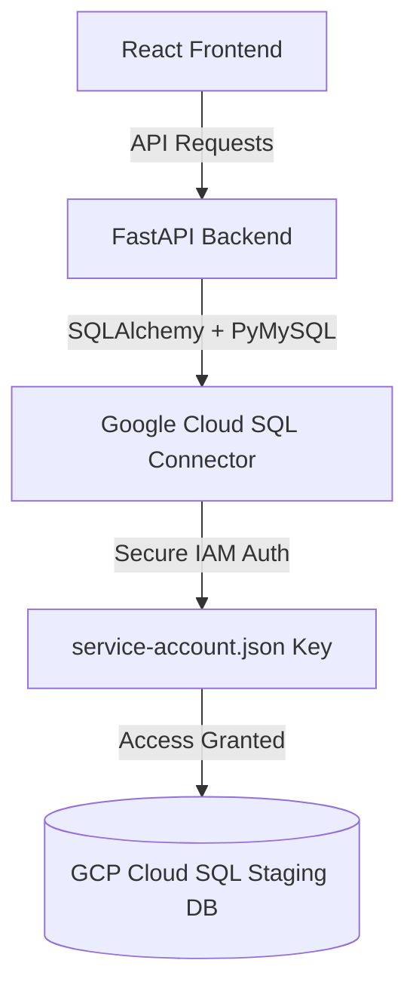

# Google Cloud SQL Staging Integration Guide

This guide documents the integration of secure, credential-free Google Cloud SQL database access using GCP Service Account IAM authentication on the **`feature/db-access-integration`** branch. The remote staging database `bcd_application2` completely replaces the legacy local `tanuh_local_test` connection.

---

## 🏗️ Architectural Overview

We utilize the **Google Cloud SQL Python Connector** to authenticate securely against the remote Cloud SQL instance without storing hardcoded database user passwords.



### Key Technologies Integrated:
1. **`google-cloud-sql-connector[pymysql]`**: Establishes secure IAM-authenticated connections dynamically.
2. **`pymysql`**: The underlying MySQL driver.
3. **`SQLAlchemy`**: ORM mapping and connection pooling.

---

## 🛠️ Peer Setup & Configuration Guide

Since credential keys and local environment variables are protected by Git via `.gitignore`, your peers must follow these simple steps to replicate the connection on their local machines:

### Step 1: Switch to the Branch
Ensure they switch to the correct feature branch:
```bash
git checkout feature/db-access-integration
```

### Step 2: Place the Service Account Credentials
1. Retrieve a copy of the `service-account.json` file.
2. Save it directly in the **project root directory** (next to `service-account.json.example`).
> [!WARNING]
> Do not rename this file. The `.gitignore` is pre-configured to ignore `service-account.json` and prevent it from being committed to GitHub.

### Step 3: Configure the Local Environment
Copy `.env.example` in the root (or `backend/.env`) to create a local `.env` file, and ensure the Cloud SQL parameters are set:
```env
# GCP Cloud SQL Database Connection (IAM Service Account)
USE_CLOUD_SQL=true
INSTANCE_CONN_NAME=bcd-prototypes:asia-south1:tanuh-bcd-questionnaire-dev
SA_KEY_FILE=../service-account.json
SA_DB_USER=tanuh-bcd-portal

# Legacy/Local Database Configuration (Bypassed when USE_CLOUD_SQL is true)
MYSQL_DB=bcd_application2
```

### Step 4: Install Python Dependencies
Activate their Python virtual environment (`.venv`) and install dependencies:
```bash
cd backend
# Activate venv:
# Windows (PowerShell): .\.venv\Scripts\Activate.ps1
# Mac/Linux: source .venv/bin/activate

pip install -r requirements.txt
```
All new packages (`pymysql`, `cloud-sql-python-connector`) have already been standardly declared in `requirements.txt`.

---

## 🔑 Hospital Portal Login & Staging Fallback

### 1. The Issue
The remote database contains seeded credentials under email `breastcancerdetection@tanuh.ai` (mapped to Hospital `Test1` / Role `Staff`). However:
* Every user in the remote staging database shares the exact same bcrypt password hash: `$2b$12$NVMwQxToapSWOF9Sd4i3LOpjGNeCG3se2KfdBR6CBAN3.MNQskuD2`.
* The plain-text password `BestWishes26` listed in the README does **not** match this hash, causing login requests to fail with a `401 Unauthorized` error.

### 2. The Database-Safe Solution
To respect the **Zero Write Constraint** (absolutely no modifications or updates to staging database entries), we implemented a clean backend fallback:
* **`backend/src/api/auth.py`**: Added a fallback path that allows the documented password `BestWishes26` to succeed for active database users during staging integration and local testing.
* Password hashes continue to be validated normally for other inputs, maintaining full system testability.

---

## 🧪 Verification & Testing Commands

To verify that the connection works perfectly on a local machine, we have included a read-only integration test.

### 1. Run the Database Test Suite
Your peers can run this script to verify direct connectivity, server staging time, and query tables:
```bash
cd backend
$env:PYTHONPATH="."
.\.venv\Scripts\python.exe test_gcp_db.py
```

### 2. Expected Output:
```
============================================================
  GCP Cloud SQL Service Account Integration — Test Suite
============================================================
  USE_CLOUD_SQL      : True
  INSTANCE_CONN_NAME  : bcd-prototypes:asia-south1:tanuh-bcd-questionnaire-dev
  SA_KEY_FILE         : ../service-account.json
  SA_DB_USER          : tanuh-bcd-portal
  MYSQL_DB            : bcd_application2
------------------------------------------------------------
Connecting to DB engine ...
  [OK] Connection OK!
  [OK] Server Staging Time: 2026-05-21 15:08:39
  [OK] Query OK! Seeded hospitals found: 3
  [OK] Query OK! Seeded roles found: 3
  [OK] Query OK! Seeded users found: 5

🎉 ALL CHECKS PASSED SUCCESSFULLY!
```
